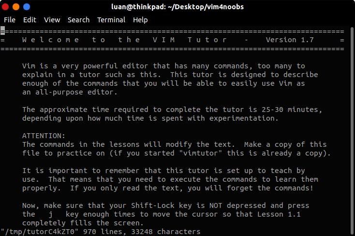
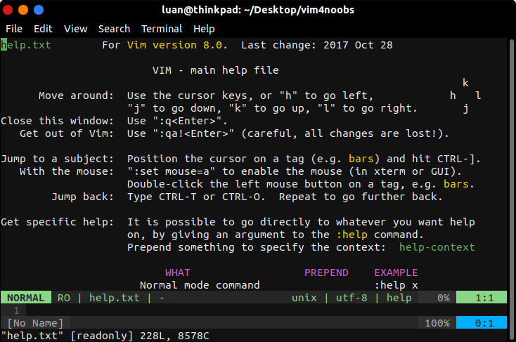

<h1>Antes de começar...</h1>

A maioria das distribuições GNU/Linux vem com o <b>Vim</b> em seus repositorios, sendo que já é bastante comum ele vir instalado por padrão.

Se o seu já estiver instalado, nada precisa ser feito. Mas se sua distribuição não tiver ou você esteja utilizando o Windows, vamos instala-lo.

<h3>Linux</h3>
O Vim pode ser facilmente instalado via apt-get, então é muito fácil de instalar em distribuições baseadas no Debian (Ubuntu / Lubuntu / Linux Mint / outros). Abra o terminal e execute o seguinte comando:

```shell
sudo apt-get install vim 
```

<h3>Windowns</h3>
Instalar o Vim no Windowns é bastante simples, basta baixar e next, next...
<a href="https://www.vim.org/download.php">Vim Download</a>

<h2>Dicas iniciais</h2>

Pronto, agora que já estamos com o Vim instalado, vamos usa-lo!

Para abrir um arquivo com o Vim, digite no terminal:

```shell
vim texto.txt
```

onde <i>"texto.txt"</i> é o nome do arquivo que deseja-se <b>criar</b> ou <b>editar</b>.

Em algumas distribuições pode-se usar <i>vi</i> ao invés de <i>vim</i>

O Vim possui um <b>tutorial</b> interno, ele e muito interessante, para acessa-lo, basta digitar o seguinte comando no terminal:

```shell
vimtutor
```


<blockquote><i>vimtutor</i></blockquote>

<h2>Como interpretar atalhos e comandos</h2>

A tecla <b><Ctrl<a>></b> e representada pelo caractere "<b>^</b>", circunflexo. 

<b>Exemplo:</b> Ctrl + O  == ^O

<h2>Ajuda</h2>

Não tente aprender tudo de uma vez e muito menos decorar, a medida que você for usando o Vim, já estará aprendendo, esse processo leva um pouco de tempo, mas valerá todo o esforço. 

Toda vez que você querer fazer alguma coisa nova ou ate mesmo coisas simples e não lembrar, use o <b>:help</b> ele te fornecera toda ajuda que você ira precisar.


<blockquote><i>:help</i></blockquote>

Se mesmo assim estiver com dificuldades use o <a href="www.google.com.br">Google</a> com certeza alguem já passou por esse mesmo problema.

<blockquote><a href="../referencias/fontes-recomendacoes.md">Fontes e Recomendações</a></blockquote>