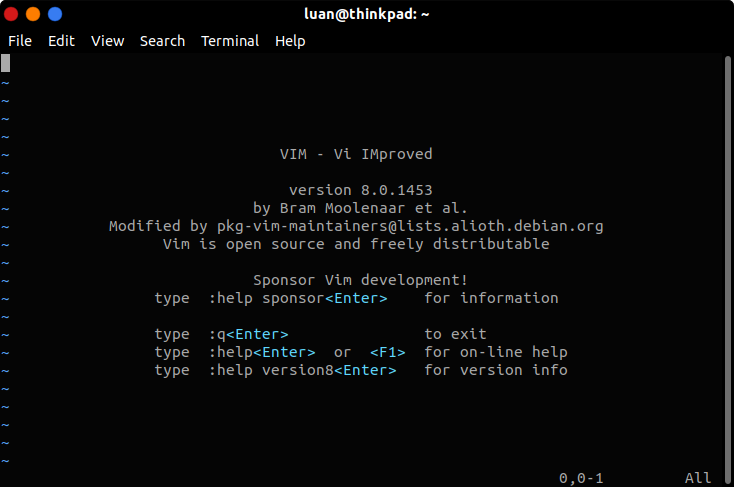
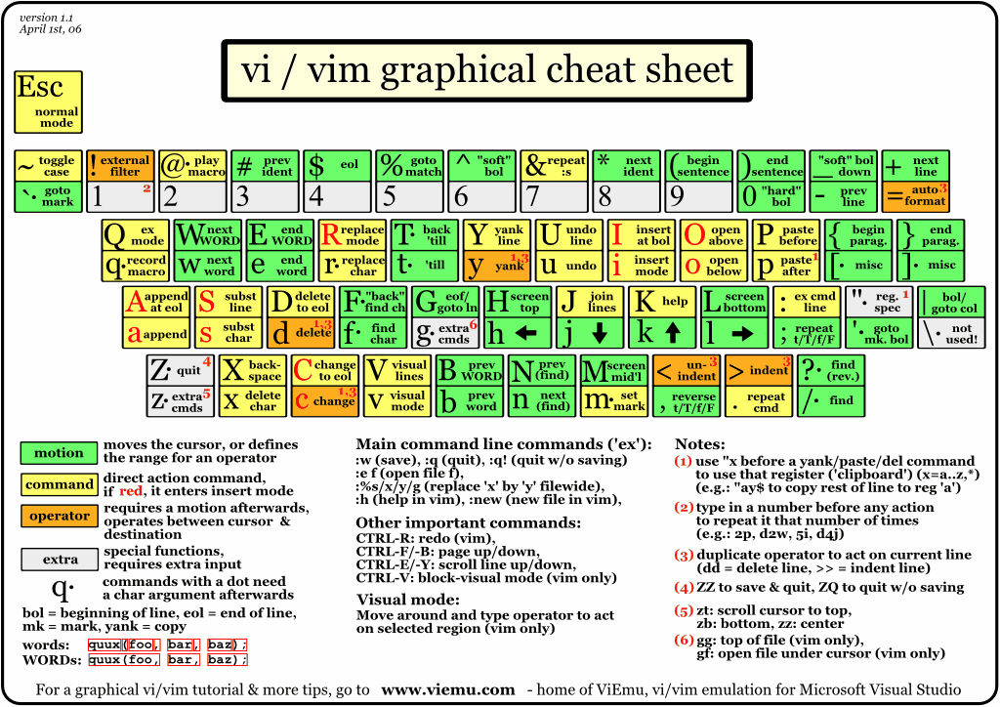

<h1>Como o Vim funciona</h1>

Quando você abre o Vim pela primeira vez, acaba se deparando com isso:

<blockquote><i>tela padrão do vim (a cor pode ser diferente devido ao tema do seu terminal).</i></blockquote>

Provavelmente, o que passa pela sua cabeça é <i>"ok, e o que eu faço agora?"</i>

Você começar a digitar, so que não funciona e se conseguir, não conseguira sair, e acaba fechando o terminal. Relaxa, tambem já passei por isso rsrsrs.

Isso acontece pois, o Vim funciona por "modos", que são estados do editor. São eles:

<b>Normal</b>
<blockquote>Para deletar, copiar, formatar, etc. 

<b>\<Esc></b>
</blockquote>

<b>Insert</b>
<blockquote>Para inserção/digitação de texto. 

<b>i, a, I, A, o, O</b>
</blockquote>

<b>Visual</b>
<blockquote>Para seleção de blocos verticais e linha inteiras. 

<b>V, v, ^v</b>
</blockquote>

<b>Command</b>
<blockquote>Para salvar, sair, pesquisar, etc. 

<b>\<Esc> :, :w, :q, :q!</b>
</blockquote>

Agora que já sabemos como o Vim funciona, vamos começar a aprender algumas teclas...

<h2>Observações</h2>

Toda vez que for trocar de modo, você sempre irá passar pelo Normal, na dúvida aperte <b>\<Esc></b> antes da sua tecla de acesso.

Para identificar em qual modo você está, olhe no rodapé da tela.

<blockquote><i>modo insert.</i></blockquote>

No Vim letra maiúscula faz coisas diferentes das minúsculas.

Só por <b>curiosidade</b> coloquei aqui o mapeamento de todas as teclas no Vim. Não se apavore, e não tente decorar, com o tempo você vai aprender

<blockquote><i>mapeamento de teclas do Vim.</i></blockquote>

<blockquote><a href="../referencias/fontes-recomendacoes.md">Fontes e Recomendações</a></blockquote>