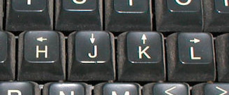

<h1>Movimentando</h1>

Como um dos principios do Vim é agilidade, pode-se utilizar ao invés de setas, as letras <b>h</b>, <b>j</b>, <b>k</b>, <b>l</b> <i>(modo normal)</i> como se fossem setas, onde:

<b>h : </b>esquerda

<b>j : </b>baixo 

<b>k : </b>cima

<b>l : </b>direita

<h2>Mas por que essas teclas?</h2>

Quando Bran Moolenaar estava fazendo o Vim, ele usava um <i>adm 3a</i>.

<blockquote><i>adm 3a</i></blockquote>

Esse era teclado daquela época, e as setas ficavam nessas letras.

<blockquote><i>setas</i></blockquote>

Bem diferente de hoje, onde temos um teclado com mais teclas e funções.

<h2>Aprendendo teclas</h2>

O mais legal do Vim é que quando sabemos o que uma tecla faz, e outra tambem, podemos fazer uma combinação entre elas. 
 
Agora que já sabemos nos movimentar, vamos supor que você quer descer 15 linhas, em vez de apertar <i>j</i> esse tanto vezes, basta fazer assim: <i>(modo normal)</i>

<b>15 + j = 15j</b>

O mesmo vale para qualquer uma das outras teclas.

<h2>Movimentando-se de outros jeitos</h2>

Podemos usar outras teclas para nos mover, e assim ganhar agilidade e tempo.

<b>G ............... </b><i>para ir ao final de um arquivo</i>
 
<b>gg ............. </b><i>para voltar ao topo</i>

<b>e ............... </b><i>para mover ao final de uma palavra</i>

<b>ge ............. </b><i>para mover ao final de uma palavra voltando o cursor</i>

<b>w .............. </b><i>para mover ate o começo da proxima palavra</i>

<b>b ............... </b><i>para mover ate o começo de uma palavra voltando o cursor</i>

<b>0 ............... </b><i>para mover ao começo de uma linha</i>

<b>$ ............... </b><i>para mover ate ao final de uma linha</i>

<b>} ............... </b><i>para pular ao final do parágrafo</i>

<b>% ............. </b><i>para pular <b>para</b> o fechamento de um parentese/colchete/chaves</i>

<b>^G ............ </b><i>para saber sua posição no documento</i>

<blockquote><a href="../referencias/fontes-recomendacoes.md">Fontes e Recomendações</a><blockquote>