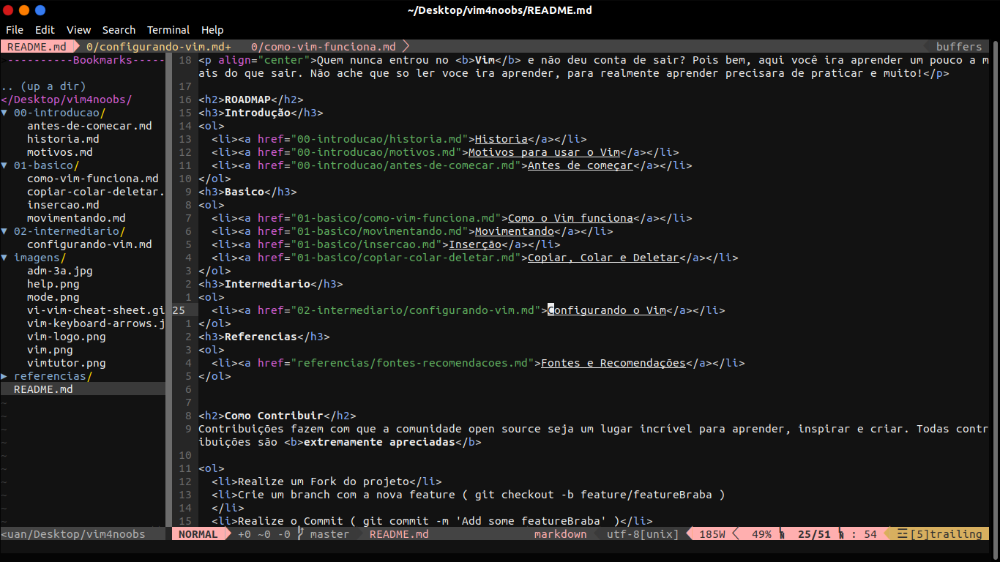

<h1>Configurando o Vim</h1>

O Vim puro, não é muito atraente, por isso vamos fazer um .vimrc para podermos configurar o nosso editor e instalar temas e plugins.


<blockquote><i>tela padrão do vim (a cor pode ser diferente devido ao tema do seu terminal).</i></blockquote>

<h2>.vimrc</h2>

Primeiros vamos acessar o nosso arquivo. Se você não tiver o .vimrc, acabamos de criá-lo.

```shell
vim ~/.vimrc
```


Vamos fazer uma configuração simples, logo, logo você entenderá o porque.
Agora que já estamos com o .vimrc aberto iremos editá-lo.

```vim
" Ativa a numeração das linhas
set number
"
" Habilita o destaque de sintaxe
syntax enable
"
" Desativa a quebra de linha automática (comentado por padrão)
set nolinebreak
"
" Insere espaços no lugar de caracteres de tabulação
set expandtab
"
" Uso inteligente de tabulações
set smarttab
"
" Define uma tabulação como sendo oito espaços
set shiftwidth=8
set tabstop=8
```

Essas configurações são  pessoais, então olhe a de outras pessoas para poder fazer o seu, leia esses posts, eles vão te ajudar:
<ul>
  <li><a href="https://www.vivaolinux.com.br/etc/vimrc-2/">.vimrc - Viva o Linux</a></li>
  <li>
 <a href="https://pt.wikibooks.org/wiki/Vim/Como_editar_prefer%C3%AAncias">Como editar preferências - WikiBooks</a></li>
  <li><a href="https://dougblack.io/words/a-good-vimrc.html">A goo vimrc - Doug Black</a></li>
</ul>

Caso você tenha preguiça de fazer, esses sites vão facilitar muito sua vida:
<ul>
  <li><a href="https://vimconfig.com/">Vim Config</a></li>
  <li><a href="https://vim-bootstrap.com/">Vim Bootstrap</a></li>
</ul>

<h2>Temas</h2>

Podemos instalar temas através de um arquivo ou plugin, os procedimentos são bastante iguais.

Confira alguns temas aqui:
<ul>
  <li><a href="https://github.com/rafi/awesome-vim-colorschemes">Awesome Vim Colorschemes</a></li>
  <li><a href="http://vimcolors.com/">Vim Colors</a></li>
</ul>

Será necessário criar uma a pasta ∼/.vim , se a mesma ainda não existir.

Os temas podem ser clonados dentro de ∼/.vim/colors para melhor organização.

Normalmente, na documentação do próprio tema tem um passo à passo de instalação, mas
basicamente você sempre vai fazer:

```shell
cd ~/.vim/colors
git clone esquemadecores.git
```
E adicionar a linha do esquema no seu .vimrc .

```vim
colorscheme esquemadecores
```
<h2>Plugins</h2>

Para instalar plugins no Vim, precisamos usar uma ferramenta, o Vundle ou Plug. Aqui utilizaremos o Vundle. Vamos lá:

1. Abra o terminal e execute:
```shell
git clone https://github.com/VundleVim/Vundle.vim.git ~/.vim/bundle/Vundle.vim
```

2. Adicione isso no seu .vimrc

```vim
" set the runtime path to include Vundle and initialize 
set rtp+=~/.vim/bundle/Vundle.vim
call vundle#begin()
" let Vundle manage Vundle, required
Plugin 'VundleVim/Vundle.vim'
call vundle#end()            " required
```
Agora já temos o Vundle instalado, só precisamos adicionar os plugins.

Site com vários plugins para o Vim:

<ul>
  <li><a href="https://vimawesome.com/">Vim Awesome</a></li>
</ul>

Nesse exemplo vou instalar a sintaxe do Javascript.

1. Abra o .vimrc e adicione o plugin antes de "call vundle#end()"

```vim
Plugin 'pangloss/vim-javascript'
```

2. Abra o Vim

```shell
vim
```

3. Execute o comando

```vim
:PluginInstall
```

4. Agora é só sair

```vim
:q
```

Pronto, já temos o plugin instalado. Você pode instalar quantos plugins quiser, mas quanto mais plugins voce tiver, seu Vim pode começar a ficar lento.

Visite o site do <a href="vimawesome.com/">VimAwesome</a>, lá tem muitas coisas legais.

Dicas de Plugins:
<ul>
  <li><a href="https://medium.com/@huntie/10-essential-vim-plugins-for-2018-39957190b7a9">10 essential Vim plugins for 2018</a></li>
  <li><a href="https://opensource.com/article/19/11/vim-plugins">Top 10 Vim plugins for programming in multiple languages</a></li>
</ul>

Não esqueça de usar <a href="www.google.com">Google</a>.

<h2>Meu Vim <3</h2>


<blockquote><i>plugins e tema que estou utilizando</i></blockquote>

Esse é o meu Vim, toda essa configuração foi feita através do Vim Bootstrap com algumas mudanças como o tema e mais alguns plugins. Não vou deixar o meu <i>.vimrc</i> porque ta uma bagunça, e não tem nada de especial. 

Lembra quando eu falei por que iríamos fazer um .vimrc simples, esse é o motivo, Vim Bootstrap.

<b>OBS:</b> o Vim Bootstrap usa o Plug e não o Vundle.

<blockquote><a href="../referencias/fontes-recomendacoes.md">Fontes e Recomendações</a><blockquote>