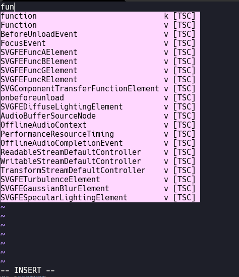
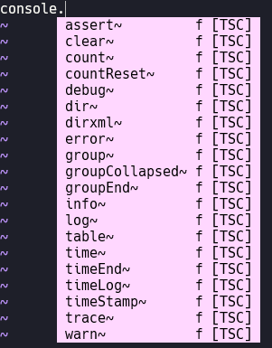
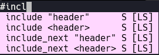
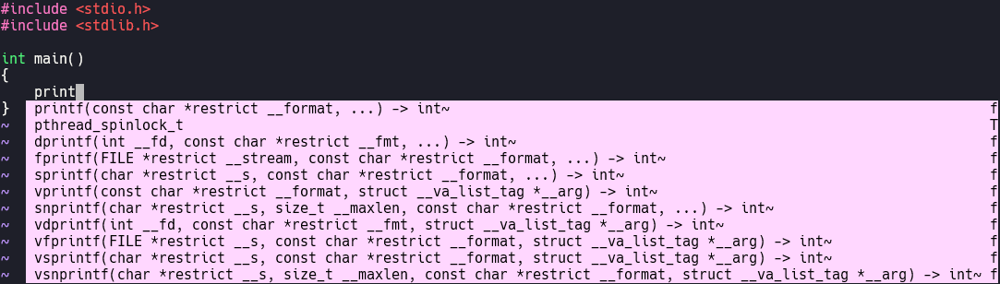

# Code Completion

Como vimos, apesar de toda a facilidade que o VIM nos oferece, ele é meio "useless" sem configurações adequadas perto de editores de textos atuais. Para contornar isso, nós podemos usar Plugins como vimos no módulo intermediário.

Os Plugins são funcionalidades desenvolvidas por qualquer usuário (inclusive você pode desenvolver o seu próprio Plugin) para extender o poder do VIM. Com isso, temos uma variedade de opções para adequar o VIM ao nosso uso. Porém uma feature que faz bastante falta no VIM, é o Code Completion. O Code completion é uma feature que provém de um LSP e que pode ser usada tanto por editores de texto quanto IDEs. Se você já programava utilizando o VSCode, sabe que ao digitar alguma Keyword da linguagem, o próprio VSCode já te sugere uma funcionalidade baseada no texto que você digitou. Algumas maneiras de contornar isso utilizando o VIM, é instalar o Plugin referente a linguagem que queremos ter esse auxílio, porém quanto mais linguages nós precisarmos dessa feature, mais cheio e totalmente "bloatado" o seu arquivo de configuração do VIM irá ficar. É aí que surge um Plugin chamado [CoC, ou Conquer of Completion](https://github.com/neoclide/coc.nvim).

O CoC nada mais é que um Plugin que facilita a nossa vida ao organizar LSPs para linguagens de programação em um único Plugin. Por isso, a partir da instalação dele, podemos instalar quantos LSPs ou Features de linguagens que querermos, de forma fácil e prática.

**OBS:** O CoC necessita do NodeJS instalado no seu SO.

Para instalar o CoC, adicione essa linha no seu arquivo de configuração do VIM.

`Plug 'neoclide/coc.nvim', {'branch': 'release'}`

**OBS:** Para utilizar o CoC, recomendo a utilização do gerenciador de Plugins [VIM Plug](https://github.com/junegunn/vim-plug).

Logo após adicionar essa linha, reinicie seu VIM e dê `:Pluginstall`

A partir de agora podemos instalar as Features das linguagens que querermos de duas maneiras, através do próprio Plugin ou através do arquivo de configuração do Plugin.

Para instalar através do próprio Plugin, digite o comando `:CocInstall` seguido do LSP ou Feature que você deseja instalar (com uma rápida pesquisa no Google, você consegue achar o da respectiva linguagem que você quer instalar). No caso do NodeJS, apenas entre com o comando `:CocInstall coc-tsserver`. Após isso, reinicie seu VIM e abra um arquivo com extensão JS ou TS e você verá o Code Completion funcionando.





Porém você também tem a opção de instalar manualmente. Instalando manualmente você garante que o VIM utilizará o LSP que você especificar, mas você terá que instalar o LSP no seu SO manualmente.

Para instalar um LSP manualmente, abra o arquivo de configuração do CoC entrando com o comando `:CocConfig` no seu VIM. Com esse arquivo nós podemos especificar versões do LSP que querermos intalar (isso é vantajoso quando a versão do LSP que o CoC usa não é a versão que você quer usar ou está acostumado). Com o arquivo aberto, procure pelo respectivo LSP que você deseja instalar (novamente, com uma rápida pesquisa no Google você encontra alguns LSPs para cada linguagem) e pegue o JSON de configuração dele. Nesse exemplo, usaremos o ***CCLS***, que é um dos LSPs disponíveis para C e C++. Cole as seguintes linha no arquivo de configuração do CoC, e, após colar, salve e feche o arquivo.

```
{
    "languageserver": {
        "ccls": {
            "command": "ccls",
            "filetypes": [
                "c",
                "cpp",
                "objc",
                "objcpp"
            ],
            "rootPatterns": [
                ".ccls",
                "compile_commands.json",
                ".vim/",
                ".git/",
                ".hg/"
            ],
            "initializationOptions": {
                "cache": {
                    "directory": "/tmp/ccls"
                }
            }
        }
    }
}
```

Porém isso apenas "mostra" para o CoC qual LSP queremos utilizar, ainda falta instalarmos o próprio LSP no nosso SO (quando você faz a instalação do LSP pelo próprio Plugin do CoC, ele instala o LSP automaticamente na nossa máquina, porém especificando pelo arquivo de configuração isso precisa ser feito manualmente). Bom, a instalação do server do LSP depende do SO que você está utilizando, deixarei dois exemplos dos gerenciadores de pacotes mais famosos do Linux, porém caso você utilize outro SO, uma rápida pesquisa no Google já resolve.

No **Arch Linux e derivados:** `sudo pacman -S ccls`

No **Ubuntu e derivados:** `sudo apt install ccls`

Agora, nós temos Code Completion e outras Features ao abrir um arquivo C ou C++.





Prontinho. Agora sabemos como configurar Code Completion dentre outras Features que editores de textos famosos e IDEs tem no próprio VIM, seja manualmente ou direto pelo Plugin do CoC. Como foi mencionado no módulo intermediário, quanto mais Plugins nós tivermos no nosso arquivo de configuração do VIM, mais o VIM irá ficando lento, porém o CoC não impacta tanto no desempenho quanto outros Plugins que fazem a instalação dos Completions para nós.
