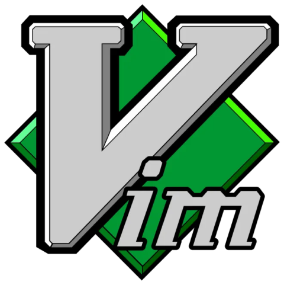

  

  
<h1 align="center">vim4noobs</h1>

Quem nunca entrou no <b>Vim</b> e não deu conta de sair? Pois bem, aqui você irá aprender um pouco a mais do que sair. Não ache que só ler você irá aprender, para realmente aprender precisará de praticar e muito!

<h2>ROADMAP</h2>
<h3>Vim</h3>
<ol>
  <li><a href="https://youtu.be/RydlHE6OpRM">O que é? porque usar? e configurações...</a>
</ol>
<h3>Introdução</h3>
<ol>
  <li><a href="00-introducao/historia.md">História</a></li>
  <li><a href="00-introducao/motivos.md">Motivos para usar o Vim</a></li>
  <li><a href="00-introducao/antes-de-comecar.md">Antes de começar</a></li>
</ol>
<h3>Básico</h3>
<ol>
  <li><a href="01-basico/como-vim-funciona.md">Como o Vim funciona</a></li>
  <li><a href="01-basico/movimentando.md">Movimentando</a></li>
  <li><a href="01-basico/insercao.md">Inserção</a></li>
  <li><a href="01-basico/copiar-colar-deletar.md">Copiar, Colar e Deletar</a></li>
</ol>
<h3>Intermediário</h3>
<ol>
  <li><a href="02-intermediario/configurando-vim.md">Configurando o Vim</a></li>
  <li><a href="02-intermediario/buscas-substituicoes.md">Buscas e Substituições</a></li>
  <li><a href="02-intermediario/usando-ctrl.md">Usando o Ctrl</a></li>
  <li><a href="02-intermediario/arquivos-janelas.md">Arquivos e Janelas</a></li>
  <li><a href="02-intermediario/acabou.md">Acabou?</a></li>
</ol>
<h3>Referências</h3>
<ul>
  <li><a href="referencias/fontes-recomendacoes.md">Fontes e Recomendações</a></li>
</ul>

<h2>Como Contribuir</h2>
Contribuições fazem com que a comunidade <i>Open Source</i> seja um lugar incrível para aprender, inspirar e criar. Todas contribuições são <b>extremamente apreciadas</b>

<ol>
  <li>Realize um Fork do projeto</li>
  <li>Crie um branch com a nova feature ( git checkout -b feature/featureBraba )</li>
  <li>Realize o Commit ( git commit -m 'Add some featureBraba' )</li>
  <li>Realize o Push no Branch ( git push origin feature/featureBraba )</li>
  <li>Abra um Pull Request</li>
</ol>

<h2>Autores</h2>

<ul>
  <li><b>Luan Mateus (hellowluan)</b> - <i>Developer</i> - <a href="https://www.instagram.com/hellowluan/">Instagram</a></li>
</ul>

Made with 💜

